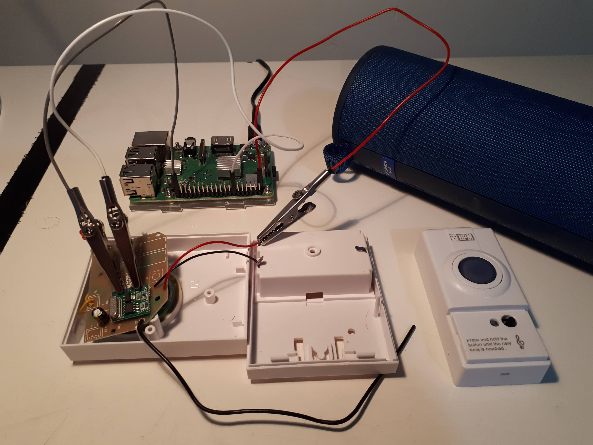
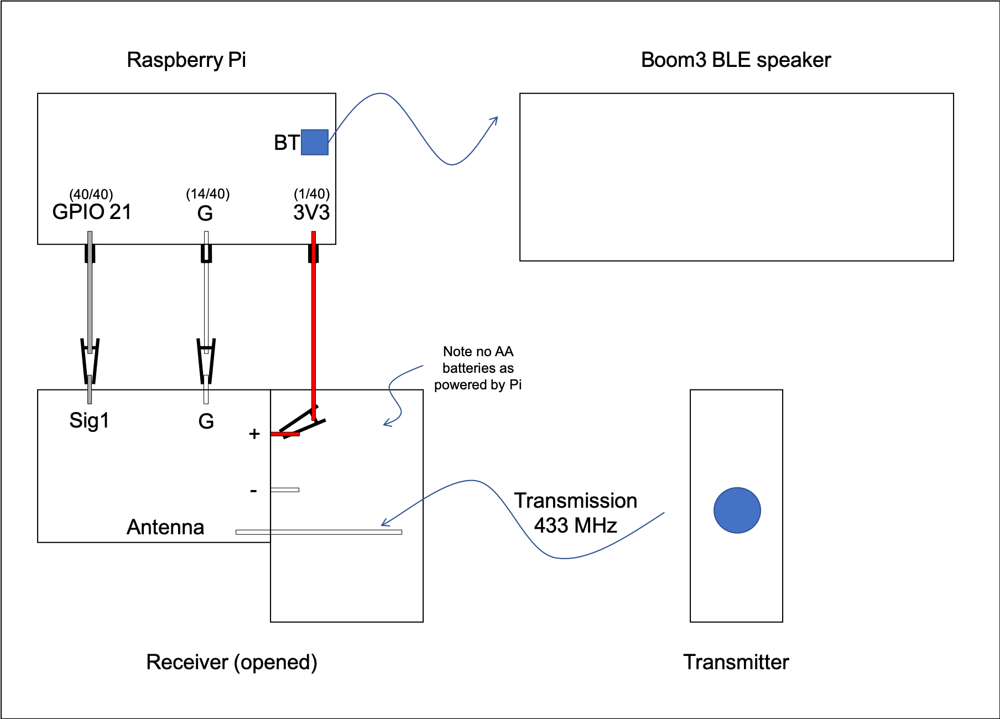

# Pi Doorbell

Plays memes whenever someone rings the doorbell !

# How

A raspberry pi intercepts the reciever signal from a doorbell transmission
and, using python, will play a sound through a BLE (Bluetooth Low Energy) Speaker.

# Components

- BLE Speaker: specifically Ultimate Ears Boom3 (~200AUD)
- Doorbell: HPM Wireless Doorbell Kit model D642/01 (~10AUD)
- Raspberry Pi: model 3B+ with 5V charger and noobs (~100AUD)
- Electrical components: (~10AUD)
  - 3 gpio leads (one end must be female)
  - 3 alligator clips (preferably with insulators)

Total cost is ~320AUD

Luckily I have a boom3 and pi so this project cost me $20

# Wiring Pics
Picture below shows the wiring of the pi to the reciever

Main components can be shown in the below schematic 

## Method 

When the doorbell button is pressed a signal is sent from the doorbell's transmitter to the doorbell's receiver. 
The reciever has a signal pin that outputs voltage when the doorbell rings. By connecting the receiver's signal pin to 
one of the raspberry pi's (3B+) GPIO pins, the pi can intercept the signal. 

When this signal is detected the BLE speaker is turned on (if not already on) which is possible due to BLE. 
Turning the speaker on is achieved by bluetooth snooping the params in the signal sent from the Boom app. 
The speaker is connected using bluetoothctl commands (if previously paired manually)
Then a meme (as a wav file) is chosen at random from a list of wav files and played using bluealsa's aplay command. 

The pi is powered by 5V from the wall, the reciever is powered by the 3V3 pin on the pi and the doorbell's transmitter is powered by its own battery.  

# Instructions

## install

- Using Raspian version 10 Buster, install the following packages:

`apt install bluetooth`

`apt install blueman`

`apt install bluealsa`

- Download the repo as a zip.

- In the existing etc folder of the pi add the '.asoundrc' file found in the etc folder of the repo.
- move 'doorbell.py' in whichever directory you like for example 'Desktop'
- make sure the folder 'wavs' is in the same directory as 'doorbell.py'
- (optional) add other wav files of your choosing ensuring to match the file names with the memes array at the top of 'doorbell.py'

## bluetooth

Information about hacking a Boom3 can be found in [this reddit post](https://www.reddit.com/r/shortcuts/comments/dz9zun/finally_turn_on_ue_boom_bluetooth_speaker/). 
To summarise the post:

Download the Ultimate ears app and connect to the Boom3 device. The app has a button that turns the Boom3 on. This feature is possible as the device is BLE.
The aim is to sniff the package sent to the boom to find its handle, value and device hex. However as pointed out in the comments there are easier ways to find these variables.
 - handle: for a boom3 the handle will be '0x0003'. For other BLE speakers or even the megaboom this may be different and you may need to sniff packets like in the post either with Packetlogger or Wireshark (I used wireshark for android).
 - value: this is just an address appended with '01' where the address is the bluetooth address of the phone which has the ultimate ears app installed. find BT address [for ios](https://www.techwalla.com/articles/how-do-i-find-a-bluetooth-address) or [for android](https://www.technipages.com/android-find-bluetooth-address)
 - device hex: if you manually connect the pi to the boom3, and run `hcitool con` you can see a list of devices connected to the pi. Only connecting the boom3 should show one hex address corresponding to the boom3

## wiring

setup the wiring like in the above photo and schema.
[this link](https://forum.core-electronics.com.au/t/433mhz-remote-control-by-hacking-a-wireless-doorbell-arduino-and-raspberry-pi/7799) has further instructions on how to wire the reciever and what the other pins do.
The boom3 should be connected once manually and you can turn it off before running the script. Also when the doorbell is pressed the result is to play a tune from the doorbell's list of tunes then play the meme through the speaker. You can select a tune that is short (3 knock sound) so to not play over the meme. You can select different sounds by holding the small black button on the transmitter. 

## run

open the 'doorbell.py' script in thorny and run. Or use command
`python3 Desktop/doorbell.py`

Then test by pushing the doorbell

stop the script with
`pkill -9 -f Desktop/doorbell.py`

# issues
 - todo
