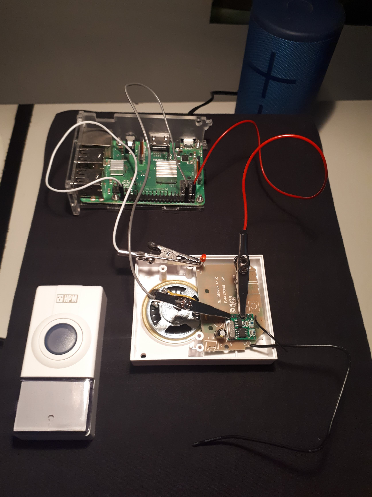
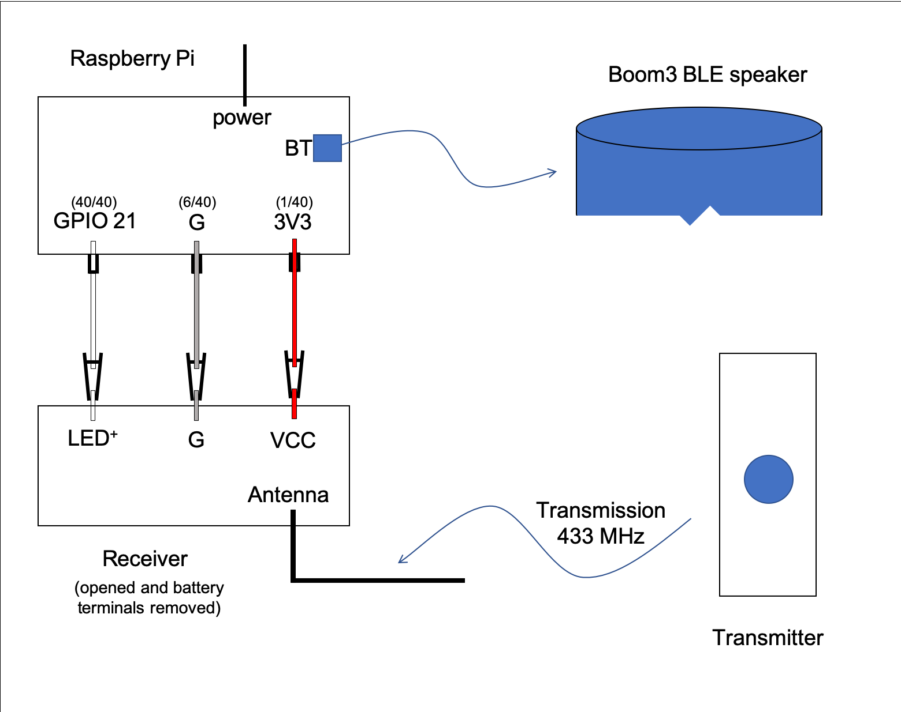

# Pi Doorbell

Plays memes whenever someone rings the doorbell !

```diff
- IMPORTANT The tune that comes with the doorbell will always be triggered 
- BUT bluetooth will not always connect so not 100% consistent. 
```

A Raspberry Pi intercepts the receiver signal from a doorbell transmission
and, using python, will play a greeting sound (a meme) through a BLE (Bluetooth Low Energy) Speaker.

# Components

- BLE Speaker: using Ultimate Ears Boom3 (~200AUD) for this project
- Doorbell: HPM Wireless Doorbell Kit model D642/01 (~10AUD)
- Raspberry Pi: model 3B+ with 5V charger and noobs (~100AUD)
- 3 gpio leads, each with alligator clip to female end (~10AUD)

Total cost is ~320AUD

Luckily I have a boom3 and pi so this project cost me $20

# Wiring Pics
Picture below shows the wiring of the pi to the receiver



Main components can be shown in the below schematic 



## Overview 

When the doorbell button is pressed a signal is sent from the doorbell's transmitter to the doorbell's receiver. 
The receiver has a LED cathode wire that pulses when the doorbell rings. By connecting the receiver's LED to 
one of the raspberry Pi's GPIO pins, the Pi can intercept the signal. 

The Pi's python script "doorbell.py" listens for the signal on its GPIO pin. When detected it will run the bash script "play.sh" which 
 - turns the speaker on (if not already on), which is possible due to BLE.  
 - connects to the Boom using bluetoothctl commands (if previously paired and trusted manually)
 - chooses a meme (as a wav file) at random from a list of wav files and plays it using pulseaudio's paplay command. 

The pi is powered by 5V from the wall, the reciever is powered by the 3V3 pin on the pi and the doorbell's transmitter is powered by its own battery.  

# Instructions

## install

- Install Raspberry Pi OS with desktop with debian: (release: 10, codename: buster) the december 4 update
- Use the instructions from [the december update](https://www.raspberrypi.org/blog/new-raspberry-pi-os-release-december-2020/) under section "How do I get it?" to properly configure pulseaudio and remove bluealsa

- Download this repo as a zip.
- In the existing /home/pi folder of your pi insert the 'doorbell' folder found in the repo.
- ensure file permissions are ok on scripts and logs
  - doorbell.py and play.sh scripts must be executable so run  
    `chmod a+x doorbell/doorbell.py`  
    `chmod a+x doorbell/play.sh`
  - also the log file must be writeable so run  
    `chmod a+w doorbell/doorbell.log`
- (optional) add other wav files of your choosing ensuring to match the file names with the memes array at the top of 'doorbell.py'.
- (optional) make the script run on boot using systemd. For this project you need to:
  - run the below command in a terminal  
    `sudo nano /etc/systemd/user/doorbell.service`  
    Note that the user directory is important as pulse audio only plays from a user and not a root user.
    This [archlinux wiki](https://wiki.archlinux.org/index.php/Systemd/User) has other directories where systemd 
    will specifically start user services (which includes /etc/systemd/user/)
  - paste the code below into the file
    ```
    [Unit]
    Description=Plays memes whenever someone rings the doorbell
    After=bluetooth.target

    [Service]
    ExecStart=/bin/bash -c '/usr/bin/python3 -u /home/pi/doorbell/doorbell.py > /home/pi/doorbell/doorbell.log 2>&1'
    ExecStop=sudo pkill -9 -f doorbell/doorbell.py

    [Install]
    WantedBy=default.target
    ```
    The .service file will start on boot after the bluetooth unit is finished.
    The ExecStart command runs the doorbell.py python script with the -u tag so stdout is captured. 
    The stdout is moved to doorbell.log which tracks all logs since service start. 
    2>&1 also ensures errors are printed in the logs.
  - to save,  
    hit: ctrl + x, y, enter  
    and run the follwing commands  
    `sudo systemctl daemon-reload`  
    `systemctl --user enable doorbell.service`
  - to start the service either  
    run command `systemctl --user start doorbell.service`  
    or reboot pi `sudo reboot -h now`
  - to stop the service either  
    run command `systemctl --user stop doorbell.service`  
    or turn off the pi `sudo shutdown -h now`
  
## bluetooth

Information about hacking a Boom3 can be found in [this reddit post](https://www.reddit.com/r/shortcuts/comments/dz9zun/finally_turn_on_ue_boom_bluetooth_speaker/). 
To summarise the post:

Download the Ultimate ears app and connect to the Boom3 device. The app has a button that turns the Boom3 on. This feature is possible as the device is BLE.
The aim is to sniff the package sent to the boom to find its handle, value and device hex. However as pointed out in the comments there are easier ways to find these variables.
 - handle: for a boom3 the handle will be '0x0003'. For other BLE speakers or even the megaboom this may be different and you may need to sniff packets like in the post either with Packetlogger or Wireshark (I used wireshark for android).
 - value: this is just an address appended with '01' where the address is the bluetooth address of the phone which has the ultimate ears app installed. find BT address [for ios](https://www.techwalla.com/articles/how-do-i-find-a-bluetooth-address) or [for android](https://www.technipages.com/android-find-bluetooth-address)
 - device hex: if you manually connect the pi to the boom3, and run `hcitool con` you can see a list of devices connected to the pi. Only connecting the boom3 should show one hex address corresponding to the boom3

You should now replace the variables `BOOM_HEX`, `BOOM_VALUE`, `BOOM_HANDLE` in the "play.sh" script.

"play.sh" also has `BOOM_CARD` which may be needed in the rare case where the device is connected but not sinked. To get this card value, you must pair and trust the boom manually with the Pi. Then run  
`pacmd list-cards`  
You may see cards for an audio jack and hdmi but find the card that contains the boom's hex. Under the index, copy the contents of the name field inside and excluding the arrow <> brackets, and set this as the `BOOM_CARD`

"play.sh" also has absolute paths to bluetoothctl and pulseaudio. These should be correct but you can double check them by running  
`which bluetoothctl`  
which should return "/usr/bin/bluetoothctl". If the path is different copy it into the `BTCTL` value. You can repeat this for pulseaudio.

## wiring

Setup the wiring like in the above photo and schema.

Note that the Pi's internal pull down resistor must be enabled (as in below line from the doorbell.py script)  
`GPIO.setup(pinIn, GPIO.IN, GPIO.PUD_DOWN) # set input terminal with internal pull down resistor`  
An external pull down resistor is not required. The pull down resistor will stop interference on the input (white) wire from causing a high reading due to a floating state caused when the circuit is open. This stops the doorbell from playing randomly. It is also important that the input (white) wire is connected to the LED's cathode (marked with a +) to reduce interference and to give a more consistent signal. 

Many thanks to Core Electronics for [this article](https://forum.core-electronics.com.au/t/433mhz-remote-control-by-hacking-a-wireless-doorbell-arduino-and-raspberry-pi/7799) which inspired my project. It shows how others have wired the same receiver differently and what the other receiver pins do. Note that you could connect the input GPIO on the Pi to one of the pins on the reciever chip (sig1 or sig2) however their pulses are not consistent enough (see pulses folder for more explanation) and can cause voltage spikes that somehow ignore the effect of the Pi's internal pull down resistor. Using the LED eliminates both these problems.

When the doorbell is pressed the result is to play 2 sounds:
 - tune from the doorbell's list of tunes followed by 
 - meme through the boom speaker
You can select different sounds by holding the small black button on the transmitter. You can select a tune that is short (3 knock sound) so to not play over the meme. 

## run

If using the run on boot instruction in "install" section, you can:
- (optional) loggin through SSH and disable VNC with `sudo raspi-config` > Interface Options > VNC > No > Ok > Finish
- turn boom on
- reboot with `sudo reboot -h now` and wait till the connecting light appears on the boom
- test by pushing the doorbell transmitter
- (optional) Now, you can turn the speaker off and repeat the previous step to test that the script works when the speaker is off.

From here the doorbell should work continuously but if there is an error you can check the logs by: 
  - loggin through SSH and enable vnc with `sudo raspi-config` > Interface Options > VNC > Yes > Ok > Finish
  - open VNC and you will see an open "XTerm" terminal with the logs in it.
  - If the font is too small you can copy contents in Xterm by highlighting the text (this automatically copies it) then pasting the contents into text editor with the middle mouse button
  
At anytime you can stop the script by running `sudo pkill -9 -f doorbell/doorbell.py`. Or just shutdown the pi.

Alternatively if not running on boot you can open the 'doorbell.py' script in thonny and press run. Or use command `python3 Desktop/doorbell.py` in SSH or GUI terminal. These options do not work continuously as the SSH session or VNC session may cut out when your computer is asleep.

# Issues
- [ ] Run instructions are quite complicated and should not need the GUI to read logs. This could potentially be fixed with systemd however I'm unsure how to create the .service files needed.
- [x] Wiring is ugly (lots of wires and clips). Placing the receiver on a breadboad would look better and reduce the chance of clips touching (or bad crimping) resulting in a short circuit. The problem with placing the reciever on the breadboard is that it loses its default bell that is provided with the doorbells circuit board. I would prefer to keep this incase the bluetooth component fails. Marking as complete for now
- [x] Sometimes pi receives input randomly, ~~possibly due to cross talk in wires~~. I found out that this is not interference but fluctuation between high and low which is typical of an input pin even if using the pins internal pull down resistor setting. Seting up an external pull down resistor with R = 10kΩ grounds the state to 0V when there is no transmission recieved. 
