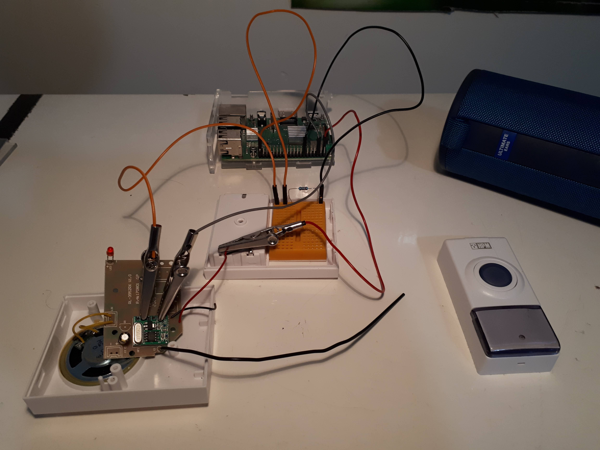
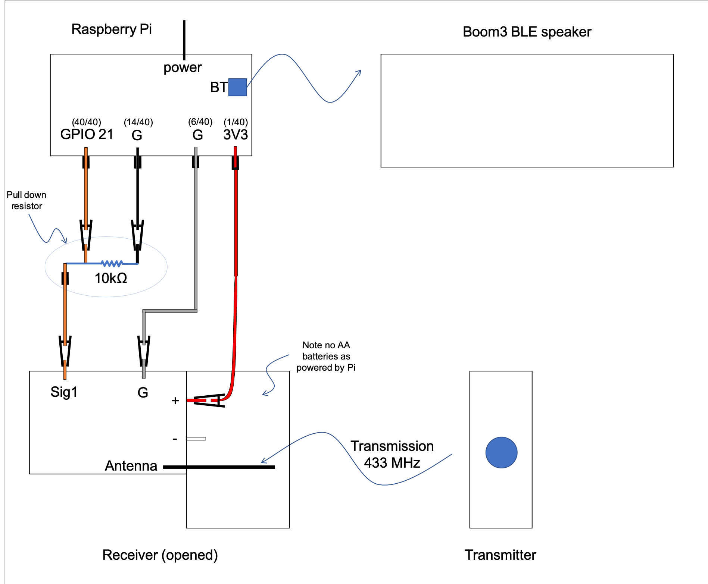

# Pi Doorbell

Plays memes whenever someone rings the doorbell !

A raspberry pi intercepts the receiver signal from a doorbell transmission
and, using python, will play a greeting sound (a meme) through a BLE (Bluetooth Low Energy) Speaker.

# Components

- BLE Speaker: specifically Ultimate Ears Boom3 (~200AUD)
- Doorbell: HPM Wireless Doorbell Kit model D642/01 (~10AUD)
- Raspberry Pi: model 3B+ with 5V charger and noobs (~100AUD)
- Electrical components: (~15AUD)
  - 5 gpio leads
    - x1 alligator to male
    - x2 alligator to female
    - x2 female to male
  - bread board
  - resistor 10kΩ

Total cost is ~325AUD

Luckily I have a boom3 and pi so this project cost me $25

# Wiring Pics
Picture below shows the wiring of the pi to the receiver

Main components can be shown in the below schematic 

## Overview 

When the doorbell button is pressed a signal is sent from the doorbell's transmitter to the doorbell's receiver. 
The receiver has a signal pin that outputs voltage when the doorbell rings. By connecting the receiver's signal pin to 
one of the raspberry pi's GPIO pins, the pi can intercept the signal. 

When this signal is detected the BLE speaker is turned on (if not already on) which is possible due to BLE. 
Turning the speaker on is achieved by bluetooth snooping the params in the signal sent from the Boom app. 
The speaker is connected using bluetoothctl commands (if previously paired manually)
Then a meme (as a wav file) is chosen at random from a list of wav files and played using pulseaudio's paplay command. 

The pi is powered by 5V from the wall, the reciever is powered by the 3V3 pin on the pi and the doorbell's transmitter is powered by its own battery.  

# Instructions

## install

- Install Raspberry Pi OS with desktop with debian: (release: 10, codename: buster) the december 4 update
- Use the instructions from [the december update](https://www.raspberrypi.org/blog/new-raspberry-pi-os-release-december-2020/) under section "How do I get it?" to properly configure pulseaudio and remove bluealsa

- Download this repo as a zip.
- In the existing /home/pi folder of the pi insert the 'doorbell' folder found in the repo.
- (optional) add other wav files of your choosing ensuring to match the file names with the memes array at the top of 'doorbell.py'.
- (optional) make the script run on boot by following [this link](https://learn.sparkfun.com/tutorials/how-to-run-a-raspberry-pi-program-on-startup/all) specifically method 2 for autostart. For this project you need to:
  - copy the contents of doorbell.desktop (which is in the top directory of this project)
  - `sudo nano /home/pi/.config/autostart/doorbell.desktop`
  
  
## bluetooth

Information about hacking a Boom3 can be found in [this reddit post](https://www.reddit.com/r/shortcuts/comments/dz9zun/finally_turn_on_ue_boom_bluetooth_speaker/). 
To summarise the post:

Download the Ultimate ears app and connect to the Boom3 device. The app has a button that turns the Boom3 on. This feature is possible as the device is BLE.
The aim is to sniff the package sent to the boom to find its handle, value and device hex. However as pointed out in the comments there are easier ways to find these variables.
 - handle: for a boom3 the handle will be '0x0003'. For other BLE speakers or even the megaboom this may be different and you may need to sniff packets like in the post either with Packetlogger or Wireshark (I used wireshark for android).
 - value: this is just an address appended with '01' where the address is the bluetooth address of the phone which has the ultimate ears app installed. find BT address [for ios](https://www.techwalla.com/articles/how-do-i-find-a-bluetooth-address) or [for android](https://www.technipages.com/android-find-bluetooth-address)
 - device hex: if you manually connect the pi to the boom3, and run `hcitool con` you can see a list of devices connected to the pi. Only connecting the boom3 should show one hex address corresponding to the boom3
 
You should now replace the variables `boomHex`, `boomValue`, `boomHandle` in the `doorbell.py` script.

## wiring

setup the wiring like in the above photo and schema.
[this link](https://forum.core-electronics.com.au/t/433mhz-remote-control-by-hacking-a-wireless-doorbell-arduino-and-raspberry-pi/7799) has further instructions on how to wire the receiver and what the other receiver pins do. I've added an external pull down resistor on the breadbaord so that there is no high voltage produced from the floating state in the input wire (orange). This stops the doorbell from playing randomly. Aparently both an internal and external pull down resistor is needed to stop fluctuation.  

The boom3 should be paired and connected once manually. Also when the doorbell is pressed the result is to play a tune from the doorbell's list of tunes then play the meme through the speaker. You can select a tune that is short (3 knock sound) so to not play over the meme. You can select different sounds by holding the small black button on the transmitter. 

## run

If using the run on boot instruction in "install" section, you can:
- (optional) loggin through SSH and disable VNC with `sudo raspi-config` > Interface Options > VNC > No > Ok > Finish
- turn boom on
- reboot with `sudo reboot -h now` and wait till the connecting light appears on the boom
- test by pushing the doorbell transmitter
- (optional) Now, you can turn the speaker off and repeat the previous step to test that the script works when the speaker is off.

From here the doorbell should work continuously but if there is an error you can check the logs by: 
  - loggin through SSH and enable vnc with `sudo raspi-config` > Interface Options > VNC > Yes > Ok > Finish
  - open VNC and you will see an open "XTerm" terminal with the logs in it.
  - If the font is too small you can copy contents in Xterm by highlighting the text (this automatically copies it) then pasting the contents into text editor with the middle mouse button
  
At anytime you can stop the script by running `sudo pkill -9 -f doorbell/doorbell.py`. Or just shutdown the pi.

Alternatively if not running on boot you can open the 'doorbell.py' script in thonny and press run. Or use command `python3 Desktop/doorbell.py` in SSH or GUI terminal. These options do not work continuously as the SSH session or VNC session may cut out when your computer is asleep.

# Issues
- [ ] Run instructions are quite complicated and should not need the GUI to read logs. This could potentially be fixed with systemd however I'm unsure how to create the .service files needed.
- [x] Sometimes (~20% of the time) these errors occur:
   - `ALSA lib bluealsa-pcm.c:763:(_snd_pcm_bluealsa_open) Couldn't get BlueALSA PCM: PCM not found`
   - `connect: Device or resource busy (16)`
   Alsa has been purged so this error does not occur
- [x] Wiring is ugly (lots of wires and clips). Placing the receiver on a breadboad would look better and reduce the chance of clips touching (or bad crimping) resulting in a short circuit. The problem with placing the reciever on the breadboard is that it loses its default bell that is provided with the doorbells circuit board. I would prefer to keep this incase the bluetooth component fails. Marking as complete for now
- [x] Sometimes pi receives input randomly, ~~possibly due to cross talk in wires~~. I found out that this is not interference but fluctuation between high and low which is typical of an input pin even if using the pins internal pull down resistor setting. Seting up an external pull down resistor with R = 10kΩ grounds the state to 0V when there is no transmission recieved. 
- [x] logging with rc.local only shows stderr. Could be fixed with systemd. Now using autostart see "install"
