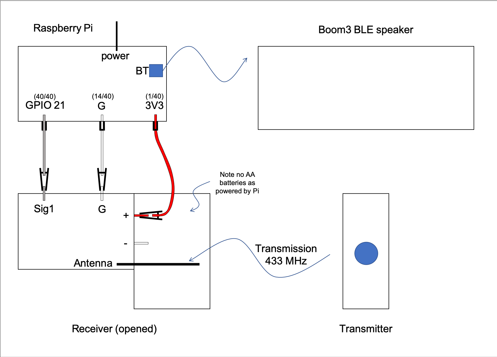

# Pi Doorbell

Plays memes whenever someone rings the doorbell !

# How

A raspberry pi intercepts the reciever signal from a doorbell transmission
and, using python, will play a sound through a BLE (Bluetooth Low Energy) Speaker.

# Components

- BLE Speaker: specifically Ultimate Ears Boom3 (~200AUD)
- Doorbell: HPM Wireless Doorbell Kit model D642/01 (~10AUD)
- Raspberry Pi: model 3B+ with 5V charger and noobs (~100AUD)
- Electrical components: (~10AUD)
  - 3 gpio leads (one end must be female)
  - 3 alligator clips (preferably with insulators)

Total cost is ~320AUD

Luckily I have a boom3 and pi so this project cost me $20

# Wiring Pics
Picture below shows the wiring of the pi to the reciever

Main components can be shown in the below schematic 

## Method 

When the doorbell button is pressed a signal is sent from the doorbell's transmitter to the doorbell's receiver. 
The reciever has a signal pin that outputs voltage when the doorbell rings. By connecting the receiver's signal pin to 
one of the raspberry pi's (3B+) GPIO pins, the pi can intercept the signal. 

When this signal is detected the BLE speaker is turned on (if not already on) which is possible due to BLE. 
Turning the speaker on is achieved by bluetooth snooping the params in the signal sent from the Boom app. 
The speaker is connected using bluetoothctl commands (if previously paired manually)
Then a meme (as a wav file) is chosen at random from a list of wav files and played using bluealsa's aplay command. 

The pi is powered by 5V from the wall, the reciever is powered by the 3V3 pin on the pi and the doorbell's transmitter is powered by its own battery.  

# Instructions

## install
  ### todo
## run
  ### todo
# issues
  ### todo
